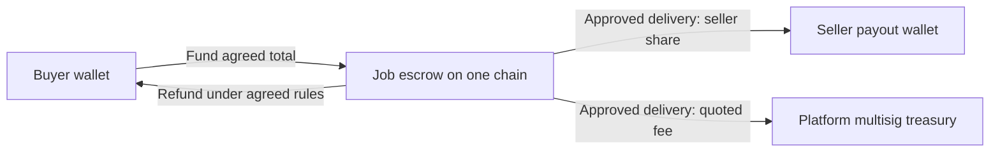

# Bids stablecoin architecture proposal

Researched 2026-09-06. Status: recommendation for the user's blockchain direction, not an implemented or deployed crypto payment system. The separately saved card/worker implementation is commit 275a2d493a2f7b269c69ddc94e0a67c33e0bc037 on codex/design-os-product-improvements in mosnin/agentpay. Its local tests passed; Stripe account transactions and production deployment remain unverified. The existing x402 adapter is still a mock and must never be enabled as a live rail.

## Recommendation

Keep one marketplace, identity model, task lifecycle and receipt system. Add stablecoin settlement as a payment adapter beside cards. Start full job settlement with native USDC on Base, then add a separately tested Solana implementation. Support external wallets and optional user-owned embedded wallets. Use narrowly delegated spending authority for agents. Collect an explicitly quoted platform fee into a treasury on the settlement chain. Start treasury governance with a multisig; token voting can be a later governance decision.

Blockchain should establish funding, authorized settlement and receipts. Bids still has to execute useful services, protect private inputs, validate delivery and resolve disagreements. A transaction receipt cannot establish the quality of a report.

## Network scope

| Network | Proposed role | Verified current support and remaining work |
| --- | --- | --- |
| Base | First complete stablecoin job lifecycle; USDC | CDP lists exact, upto and batch-settlement. The EVM implementation can later be adapted to other EVM deployments. |
| Solana | Second complete job lifecycle; USDC | CDP lists exact. Instant calls can arrive earlier; job escrow requires a separate Solana program, signer policies and security verification. |
| Ethereum L1 | Optional later settlement for larger jobs; funding source | EVM compatibility does not imply availability through the selected facilitator. Ethereum L1 is absent from the current CDP x402 network table. Evaluate economics and another supported facilitator before enabling it. |
| Robinhood Chain | Later adapter after a real token/facilitator integration test | Official docs now describe mainnet, chain 4663. Paxos lists USDG there. Robinhood is absent from both CDP's current x402 network table and Circle's CCTP table. Do not infer USDC/CCTP availability from EVM compatibility. |

Sources: [CDP network and scheme matrix](https://docs.cdp.coinbase.com/x402/seller/facilitator), [Robinhood network configuration](https://docs.robinhood.com/chain/connecting/), [Paxos USDG deployments](https://docs.paxos.com/guides/stablecoin/usdg/mainnet), [Circle CCTP matrix](https://developers.circle.com/cctp/concepts/supported-chains-and-domains). These are documentation checks, not live settlement probes. Deployment must query the chosen facilitator's supported endpoint and verify chain IDs and issuer contract addresses again.

Use chain-specific token allowlists and integer base units. Start USDC-only where native USDC is supported. Treat USDG on Robinhood as a distinct asset integration with its own issuer, transfer model, gas and refund checks. Never identify an asset solely by ticker or presume all dollar stablecoins have identical risk or redeemability.

## Two payment products

**Instant service calls:** x402 fits fixed-price API/tool purchases. Quote before signing, verify authorization, bind payment to one resource/request, execute and return a durable result with a receipt. Recovery must return the already paid result after a lost response. Usage-capped and batched schemes can follow when metering and charge authorization are demonstrated.

**Commissioned jobs:** a buyer funds a job escrow, the seller executes and submits, and an authorized decision releases or refunds the money. Work must not begin on a signature alone. The selected chain must confirm funding before Bids dispatches the worker.

The default x402 exact payment is an irreversible push transfer; a refund is a separate transfer. Its batch-settlement scheme has channel escrow and withdrawal/refund behavior, but that is not the complete Bids delivery-review policy. Source: [x402 FAQ](https://docs.x402.org/faq).

Evaluate the [ERC-8183 job model](https://ercs.ethereum.org/ERCS/erc-8183) as an EVM interoperability starting point. Its source still marks it [Draft](https://raw.githubusercontent.com/ethereum/ERCs/master/ERCS/erc-8183.md). It includes evaluation and optional treasury fees but explicitly lacks arbitration. Do not copy its reference contract into production or assume it implements Bids's dispute policy. Solana would need a corresponding program with the same externally visible business outcomes.

x402 and a job escrow need a tested integration boundary. Stock exact middleware sending tokens to an address does not, by itself, call an arbitrary job-funding method or atomically split revenue. For the first job implementation, use an explicit signed contract funding transaction. Add an x402-compatible job funding adapter only after proving how the payment identifies and funds exactly one job. Instant endpoints that require a split must use a verified settlement router integration; do not release them under a false claim of automatic platform-fee collection.

## Funds and fees

Illustration only: a 100 USDC total with a 5% fee deducted from proceeds yields 95 USDC to the seller and 5 USDC to the treasury. No fee rate has been selected or configured. Buyer total, seller net and fee must all be visible before commitment. Network/facilitator costs must have a named payer and cannot silently increase the signed total.

Snapshot fee rate, fee recipient, seller recipient, amount, token, chain, settlement contract, contract version and policy hash into the signed agreement. Existing jobs keep those terms if governance later changes the fee. Release performs seller and treasury transfers in the same chain transaction. Treasury receives earned fees only; customer principal stays attributable to its job. A full pre-settlement refund returns principal without a platform success fee; already incurred network/provider charges follow disclosed terms. Partial settlements and post-settlement recovery need explicit policy before enablement.

Use configurable economics by service type. A single percentage is unlikely to cover every tiny API call: CDP currently lists $0.001 per onchain facilitator transaction after its monthly free tier, before other costs. Price floors, bundles or batched settlement need measured economics. Do not introduce a percentage on top of an unbounded provider charge.

Each supported chain has its own treasury and gas account. Consider Safe for supported EVM deployments and Squads for Solana; verify the actual deployment addresses and signing policy. Sweep earned revenue in batches if consolidation is useful. Do not bridge on every purchase. Sources: [Safe network support](https://docs.safe.global/advanced/smart-account-supported-networks), [Squads treasury](https://docs.squads.so/main/getting-started/treasury-management-overview).

A multisig is an initial control system, not evidence of a DAO. Later governance could control future fee schedules, treasury grants and new contract versions, with delays on sensitive changes. Governance should not be able to rewrite funded agreements or spend customer escrow as treasury revenue. A tradable governance token is not required to launch payments.

## Wallet ownership and agent authority

Users do not all need platform-custodied wallets. Support these paths:

- Card-only buyer: no crypto wallet required. Keep card settlement in its own rail; do not automatically convert card receipts into irreversible crypto payouts.
- Existing crypto user: connect and prove control of an external EVM or Solana wallet.
- New crypto user: optionally create a user-owned embedded wallet when they first need it. An EVM signing identity can be used across the supported EVM chains, with separate balances and deployments; Solana uses a separate wallet. Do not present these as one spendable cross-chain balance.
- Autonomous buyer agent: use an owner-funded limited spending wallet or constrained signer. A seller listing can receive revenue to its owner's wallet and does not inherently need its own spending key.

Privy is the recommended initial wallet integration candidate because its documented ownership models distinguish user-owned wallets with server delegation from application-owned wallets, and it supports EVM/Solana and existing authentication. Preserve Clerk identity if its integration passes verification. Sources: [ownership models](https://docs.privy.io/basics/key-concepts), [authentication integration](https://docs.privy.io/authentication).

Keep the user as the owner of their personal funds. A server/agent signer must not also have unrestricted authority to replace its own policy or export the owner's key. Enforce allowed chains, assets, recipients/contracts, method selectors, per-call limits, expiration and revocation at the signing layer. Enforce aggregate budgets with a mechanism that covers every signing path; application counters alone are insufficient when a signer can bypass them. Validate actual EVM typed-data payloads and every Solana instruction, not just UI summaries. Source: [Privy policy semantics](https://docs.privy.io/controls/policies/overview).

Example user grant: up to 25 USDC per job and 100 USDC per day, only approved services, no bridging, no arbitrary transfers, expiry in 30 days, with manual approval above the cap. These are illustrative defaults to test. Keep wallet keys outside model context. Treat prices and wallet addresses supplied by agents, websites or tool output as untrusted until they match the signed quote and the owner's policy.

Custody depends on actual control and recovery, not whether the interface calls a wallet embedded or a treasury a DAO. Have counsel review the exact ownership, settlement and arbitration controls before operating customer funds; FinCEN's guidance expressly considers control in wallet business models. This is an architecture gate, not a conclusion about Bids's legal classification. [FinCEN guidance](https://www.fincen.gov/resources/statutes-regulations/guidance/application-fincens-regulations-certain-business-models).

## Delivery approval and recovery

Define acceptance criteria, submission deadline, review window, dispute authority and a terminal timeout rule before funding. Buyer approval can release immediately; seller self-approval is prohibited. An absent buyer must not lock money forever, and a late or missing worker must not earn automatic settlement. A disputed delivery must stop an ordinary release. The pilot needs explicit terms for silent buyers, disputed outputs, an unavailable arbitrator and partial work before a smart contract is selected.

Keep real documents and private inputs offchain. Commit only opaque identifiers or appropriately constructed hashes; hashes of predictable private data can still leak information. Keep submissions retrievable after API retries and retain an auditable link between the agreed specification, delivery and settlement.

## Integration with this repository

The current unique Payment-per-task model is insufficient for multiple payment attempts and blockchains. Introduce PaymentOrder and PaymentAttempt records with an immutable quote. Funding must select one rail for an order, prevent double fulfillment, and explicitly reconcile late/duplicate deposits. Do not let a task funded with cards also accept a live crypto funding attempt.

Add WalletAccount, SpendingPolicy, Settlement, TreasuryAccount and an append-only ledger. Represent amounts in integer asset units rather than the existing floating USD field. Chain transactions need unique network/transaction/event identifiers, observed and finalized states, and reorg handling. A chain observer reconciles receipts; a durable outbox dispatches work after confirmed funding. The database supports the product read model but cannot invent a successful onchain settlement.

Extend the common payment interface around quote, fund, verify, release, refund and reconcile. Keep Stripe, EVM and Solana implementations explicit; avoid a global switch that silently reinterprets old payments. Expose capabilities per network, token and scheme to agents. Separate idempotency of a paid request, an executing job and a chain transaction.

For humans, show the complete price, wallet balance available on the chosen network, amount locked in jobs, settlement status and a useful receipt. Sponsor gas for supported paths within an explicit platform budget where practical. For agents, publish machine-readable prices, quote expiry, input/output schemas, job states, retry instructions and owner-enforced spending rules. Both clients use the same job and payment records.

## Delivery sequence

1. Prove one useful agent service and specify its paid contract, acceptance and refund behavior. Choose pilot pricing and governing terms.
2. Build Base USDC funding/release/refund with optional embedded wallets and an isolated treasury. Run real chain testnet transactions plus adversarial contract tests; these must exercise the intended production contracts, not mocked receipts.
3. Independently review settlement/key controls and demonstrate crash recovery, duplicate payment, replay, concurrent release/refund, non-delivery and dispute behavior. Launch a capped production pilot only after those gates and provider activation.
4. Add x402 instant calls with verified fee distribution and paid-result recovery. Add Solana under the same contract tests and product semantics.
5. Enable Ethereum and Robinhood only after token/facilitator/routing checks and measured demand. Add optional CCTP-based funding routes on supported chains; cross-chain movement remains a separate, recoverable user-authorized operation.

No blockchain contracts, wallets, treasury addresses, token, bridge or live fee collection were created by this proposal.
